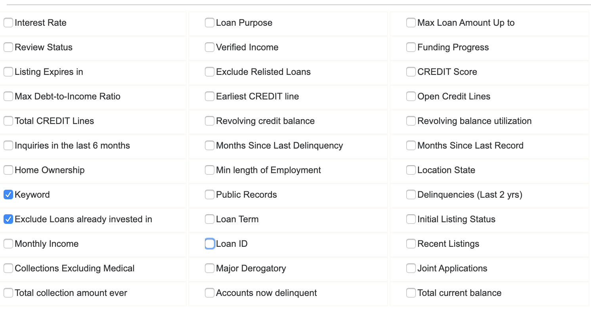

# Things to look at When You Choosing Notes

**This picture show three things to choose when choosing notes: number, grade, term. But in reality, can making investment being so simple?** 

**Define the Goal**
- The original aim as metioned in requirement file is to inform users the “best” loan to invest. 
- But how to define the "best" loan? When people make investment, they have tendency to pursue high returns. Generally high return is accompanied with high risk. While one thing that all investors can agree on is that they don't want to lose all of their principal. 
- On LC, if investors happen to pick up notes which associate with loans that turn to default, then they will lose all investment money. 
- Given this, I decide to limit analysis scope to finding attributes that can be used to identify a "good" loan. 

- I build a predictive model that can predict whether or not a loan will be fully paid or default/charged off, in order to help invesors to avoid potential loan defaulters when pick up notes to minimize the risks of investments. And find the most important factors in assisting investors to make decisions about investing.

**Data**:
In this project, I worked with the LendingClub data loan, from 2016Q1 to 2017Q4, each of which has 150 associated features. 

**Prolem Type** 
classification with 2 classes: "Default" or "Non-default".

**Data Processing** [Data Processing Notebook](https://github.com/qw2273/data_challenge/blob/master/lib/2.%20Data%20Processing.ipynb)
- Selected attributes that are visible to investors at time of picking notes 
- Divided attributes into different categories and for each category: check and impute missing values, and plot the distribution and modified some featues like type conversion(like interest rate) , new feature creation(like avg fico score),etc. 
- Investigated the correlations among the features and between the features and the target variable. 
- Check features collinarity: Cramér's V to measure of association between categorical variables, and Pearson correlations for numerical ones 
- For categorical feature with too many levels(like attr_state) , regroup to number of levels

**Model** [Modeling Notebook](https://github.com/qw2273/data_challenge/blob/master/lib/3.%20Modeling.ipynb)
- I trained a gradient boosting model to predict loan defaults and used Cross validation to aviod overfitting. Then I evaluated the models using a cross-validated AUC score on the training set. The returned an AUC score of 0.73 on the test data. 
- From feature importance analysis, I found that the five most important features are: 
   - loan related: interest rate, loan grade, monthly installment 
   - borrower related: debt to income ratio , average fico rate 

These attributes can be used as a pre-screen for loans. Combined with bivariate analysis plots, I summerize following rules for investors to help them identify a default or non-default loan.
1. Don't take risks to pick the loan with low grade and high interest rate. Trust the LC grading system, it works.
2. Be sure to check borrowers dti raio, and average fico range, aviod these with high dti and low fico rate 

**In Future**

- Due to time limitation, I didn't fine-tune the model. So I will try this later 
- Try other models and make comprasion to find the best model with time efficiency and best performance 
- Binned variables and make a scorecard for better accessing the loan and borrower. 
